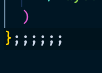

# Migrating from tslint to eslint

I recently started working on a project that was using
[TSLint](https://github.com/palantir/tslint) for static code analysis. I kept
running into issues where `TSLint` would squiggle at me for things that I knew
would be picked up by `prettier`.

Thankfully, I recently took a course where I created a
[static analysis toolchain](/blog/testing-javascript-course-static-analysis)
from scratch. One of the tools I used was
[eslint-config-prettier](https://github.com/prettier/eslint-config-prettier) -
which turns off all `eslint` rules that would conflict with or be handled on
save by `prettier`. Sure enough, there is a
[tslint-config-prettier](https://github.com/prettier/tslint-config-prettier)
module as well. Unfortunately, this didn't work out of the box for me. Given the
high amount of customization within the `tslint.json` file, the prospect of
trying to resolve this was daunting.

Fortunately, as `TSLint` has been deprecated in favor of `eslint`, I took this
opportunity to migrate the project over to `eslint`. Here are the steps I
followed

## Remove TSLint:

```
npm uninstall <all-ts-lint-libs>
```

## Add ESLint:

```
npm install --save-dev eslint @typescript-eslint/parser @typescript-eslint/eslint-plugin
```

## Configure ESLint

By default, `ESLint` expects ES5 syntax. I started by configuring my `.eslintrc`
to support modern, module-based tsx. Rather than write all of the linting rules
from scratch, I chose to implement the `eslint:recommended` preset.

```js
{
  "parserOptions": {
    "ecmaVersion": 2020,
    "sourceType": "module",
    "ecmaFeatures": {
      "jsx": true
    }
  },
  "extends": ["eslint:recommended"]
}
```

In addition to `ESLint`, we installed a few libs from `@typescript-eslint`.
Let's go ahead and add them to our configuration (taken from the
[Typescript-ESLint getting started guide](https://github.com/typescript-eslint/typescript-eslint/blob/master/docs/getting-started/linting/README.md)).

```json {2,10,13-14}
{
  "parser": "@typescript-eslint/parser",
  "parserOptions": {
    "ecmaVersion": 2020,
    "sourceType": "module",
    "ecmaFeatures": {
      "jsx": true
    }
  },
  "plugins": ["@typescript-eslint"],
  "extends": [
    "eslint:recommended",
    "plugin:@typescript-eslint/eslint-recommended",
    "plugin:@typescript-eslint/recommended"
  ]
}
```

Lastly, lest I forget the original intent of this endeavor, I needed to install
`eslint-config-prettier` and update my `.eslintrc`:

```
npm install --save-dev eslint-config-prettier
```

```json {15}
{
  "parser": "@typescript-eslint/parser",
  "parserOptions": {
    "ecmaVersion": 2020,
    "sourceType": "module",
    "ecmaFeatures": {
      "jsx": true
    }
  },
  "plugins": ["@typescript-eslint"],
  "extends": [
    "eslint:recommended",
    "plugin:@typescript-eslint/eslint-recommended",
    "plugin:@typescript-eslint/recommended",
    "eslint-config-prettier"
  ]
}
```

## Scripts + Cleanup

I had a couple of minor tasks left to complete:

### package.json

```json
"lint": "eslint '*/**/*.{js,ts,tsx}'"
```

### .eslintignore

In addition to creating an `.eslintrc`, you can create an `.eslintignore`. In my
case, I already had a `.prettierignore` already configured for my project, so I
chose to use that file instead of duplicating it:

```json {1}
"lint": "eslint '*/**/*.{js,ts,tsx}' --ignorePath .prettierignore"
```

### Cleanup

Because I ditched the highly-customized `tslint.json` file for a smattering of
`recommended` rulesets, I also had several thousand linting errors on my first
pass. The purpose of this effort was to transition over to `eslint` as quickly
as possible - as I was doing it mid-sprint. I ran `npm run lint --fix` to fix
what errors it could, and set a few custom rules to `warn` intead of `error`, so
I could clean them up in a future pass.

## Parting Thoughts

Even in an established code base with thousands of files, transitioning from
`TSLint` to `ESLint` went smoothly. The entire process took me only a couple of
hours. While I still have over 1,000 linting warnings - many of them fall into a
handful of linting rules. I'll coordinate with my team to determine which we
wish to resolve and which we'll just disable.



I'm happy to report those damn squigglies are gone!
